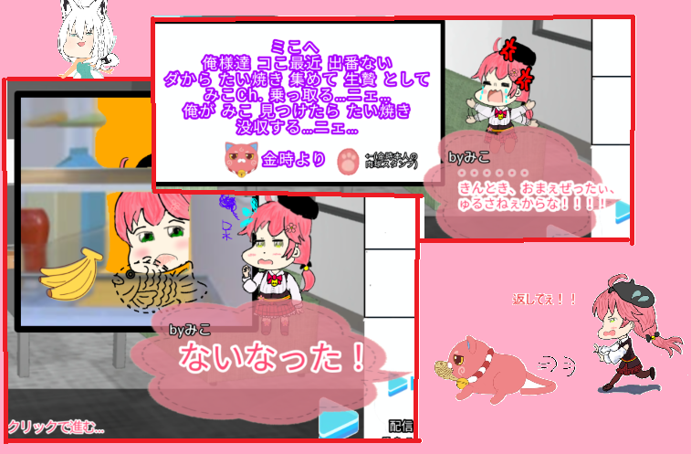
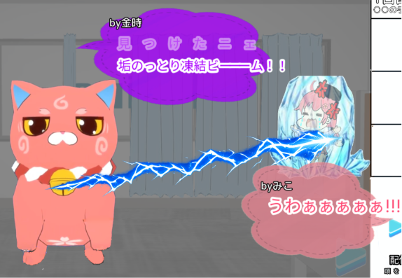
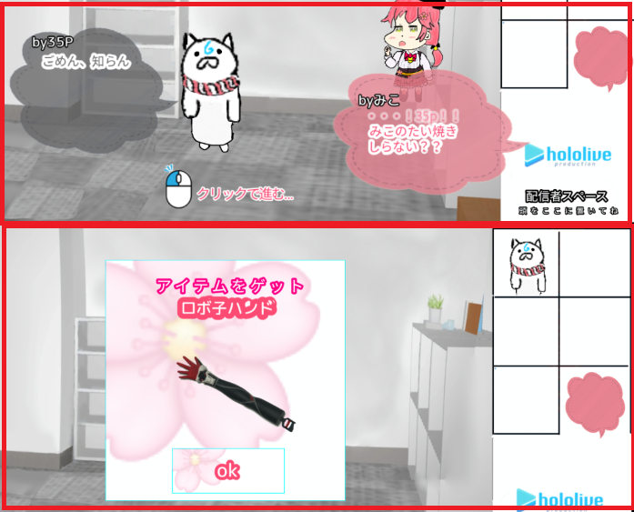
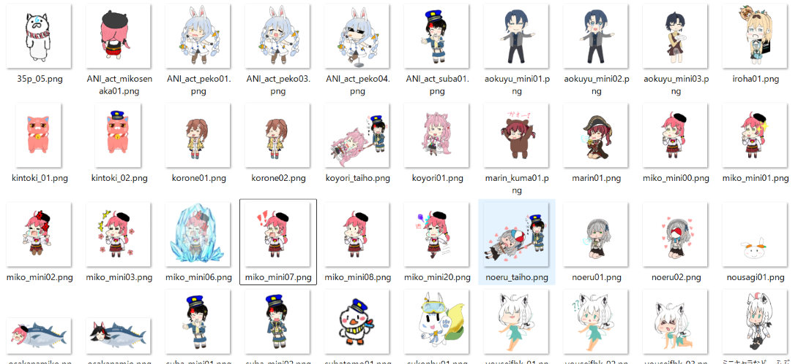
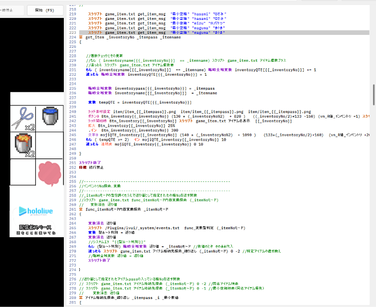
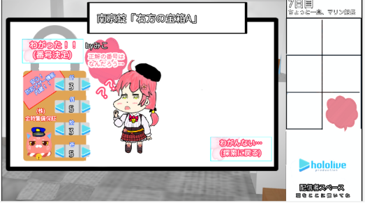
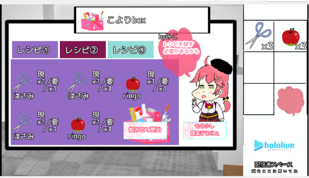

# keike_mikotaiyaki.github.io
lightVN　インディゲーム「金時にたい焼き隠された」進捗公開ページ<!DOCTYPE html>
<html lang="ja">

<head>
  <meta charset="UTF-8">
  <title>金時にたい焼き隠された</title>
</head>

<body>

<h1>「金時にたい焼き隠された！！」...とは？？</h1>

このゲームは、「ママにゲーム隠された」(作　ハップ様)より 
インスパイアを受けたホロライブ二次創作のステージクリア型脱出ギャグゲームです。 
仕様エンジンはlightvnとなります。
完成次第、偉大いなる始祖ハップ様に頭を下げてから、ホロインディーに応募します。応援してね☆

 <h2>すとーりー</h2>

主人公はわれらが人気VTuber　さくらみこ！！ 
  配信を終え、おやつタイムに・・・と思っていたらみこのたい焼きがない！！！ 
  ない！ない！！なーーーーーい！みこのたい焼きがぁ・・・( ；∀；) 
  近くには金時からの置手紙・・・こーれは許せないにぇ！！！ 
  はたしてみこはたい焼きを取り返し金時の野望を止められるのか！？

<h2>スナップショット集</h2>

<table>
<tr>

<td align="center">

 
元ネタよろしく、 金時と鉢合わせたらゲームオーバー！ 
  氷漬けにされてしまうぞ！！
</td>

<td align="center">

 
脱出ゲームにはやっぱり アイテムと情報収集が攻略のカギ！
</td>

<td align="center">

 
ホロライブの様々なキャラが登場！ 敵か味方か！？こうご期待
</td>

</tr>
</table>
  
<h2>開発進捗まとめ</h2>
<ul>
  
  <li>進捗スクリプトコードをsample_scriptにて 雑にファイリングしているのでよかったら見ていってください 
    詳しくはそちらのsample_script_readmeを参照お願いします。</li>
 
  <li>アイテムプログラム、インベントリUI基礎の完成</li>
  <li>ステージ0,1,2が完成</li>
  <li>アイテム合成ギミックUI「こよbox」実装中</li>
</ul>
  
<table>
<tr>

<td align="center">

 
アイテムの操作自由自在
</td>

<td align="center">

 
南京錠もあるよ
</td>

<td align="center">

 
こよBox
</td>

</tr>
</table>
  

</body>
</html>
